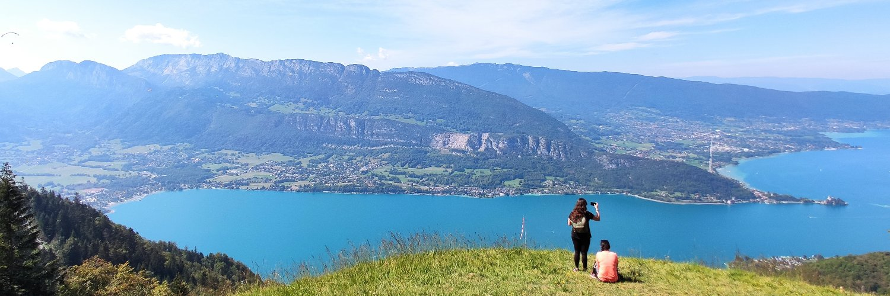

<h1 align="center">Hi there👋, I'm Maxime</h1>
<!-- <h3 align="center">Tech lover and worker from France 🇫🇷</h3> -->

    

    &nbsp;&nbsp;&nbsp;&nbsp;
    &nbsp;&nbsp;&nbsp;&nbsp;
    

---

:clapper: Watch <a href="https://www.youtube.com/watch?v=4Sn0pTQIC8E">my interview</a> as DevOps & Cloud Architect for Sopra Banking Software

---

